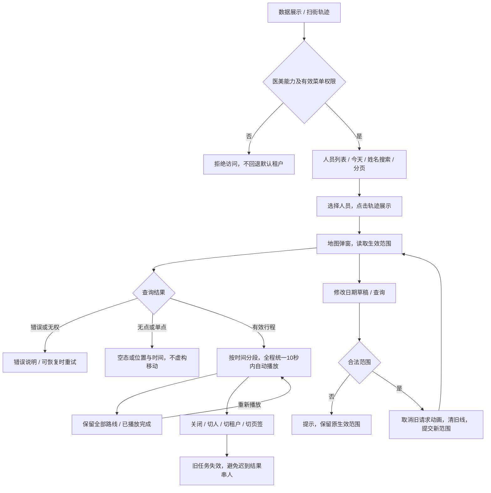

# 扫街轨迹交互流程

合同：[081@1.1.0](../docs/sdd/SPEC-SUIYIN-ADMIN-081/1.1.0/spec.md)。所有医美租户；当前8租户仅作原型验收。

```mermaid
flowchart TD
  A[数据展示 / 扫街轨迹] --> B{医美能力及有效菜单权限}
  B -->|否| C[拒绝访问，不回退默认租户]
  B -->|是| D[人员列表 / 今天 / 姓名搜索 / 分页]
  D --> E[选择人员，点击轨迹展示]
  E --> F[地图弹窗，读取生效范围]
  F --> G{查询结果}
  G -->|错误或无权| H[错误说明 / 可恢复时重试]
  G -->|无点或单点| I[空态或位置与时间，不虚构移动]
  G -->|有效行程| J[按时间分段，全程统一10秒内自动播放]
  J --> K[保留全部路线 / 已播放完成]
  K -->|重新播放| J
  F --> L[修改日期草稿 / 查询]
  L --> M{合法范围}
  M -->|否| N[提示，保留原生效范围]
  M -->|是| O[取消旧请求动画，清旧线，提交新范围]
  O --> F
  J --> P[关闭 / 切人 / 切租户 / 切页签]
  P --> Q[旧任务失效，避免迟到结果串人]
```

跨日/明确断轨/坏点处断开；不画推算补线。取消日历不提交，关闭弹窗回列表保留生效筛选；重新打开从头查并播一次。原型无真实服务；正式接口与地图联通按工程合同验收。
